# ProArchVizTool - User Guide

This comprehensive guide details the usage and configuration of the **ProArchVizTool** plugin in Unreal Engine 5. Learn how to structure directories, customize cameras, interact with lighting, swap materials/furniture, and calculate dimensions in real-time.

---

## Part 1: Installation, GameMode & HUD Configuration

This section covers the initial setup of the **ProArchVizTool** plugin, setting up the custom GameMode, and styling the Slate-based HUD.

---

### Point 1: Installation & Activation
To install and enable the ProArchVizTool features in your project:

1. Locate your downloaded plugin folder (e.g., `ProArchVizTool`).
2. Create a folder named `Plugins` at the root directory of your Unreal Engine project (if it does not already exist).
3. Copy and paste the `ProArchVizTool` folder into your project's `Plugins` directory.
4. Open your project in the Unreal Editor.
5. Open the **Edit** menu in the top toolbar of the editor and click on **Plugins**.
6. Search for `Proarchviz tool` in the search box.
7. Check the checkbox next to the plugin to enable it.
8. Restart the editor to complete the activation process.

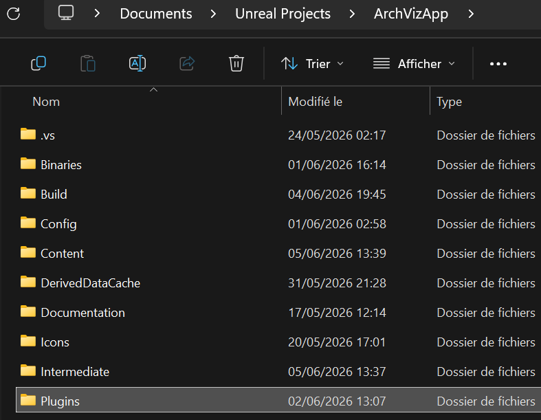
*Figure 1.1: Project root folder structure showing the Plugins directory.*

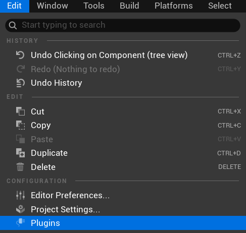
*Figure 1.2: Selecting the Plugins menu under Edit.*

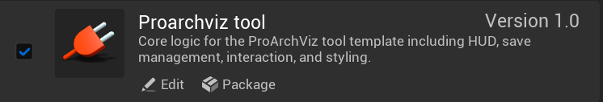
*Figure 1.3: Activating the Proarchviz tool version 1.0.*

---

### Point 2: Content Folder Layout
After activation, the plugin's built-in content, widgets, Blueprints, and assets will be accessible inside the Content Browser under the plugin directory:

1. Click on the **Settings** cog icon in the top-right corner of the Content Browser.
2. In the settings dropdown menu, make sure **Show C++ Classes** and **Show Plugin Content** are checked.

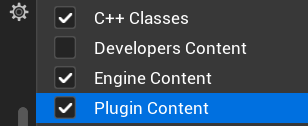
*Figure 1.4: Content Browser settings dropdown with Show Plugin Content checked.*

3. The plugin directory contains subfolders for Blueprints, UI assets, C++ classes, and configuration files.

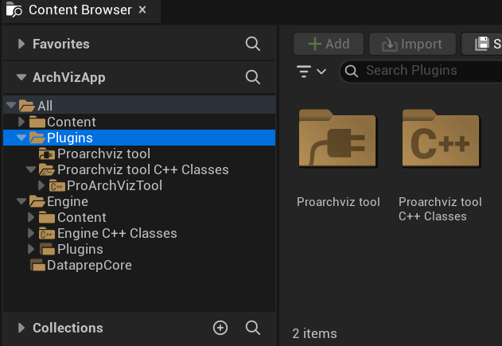
*Figure 1.5: Viewing the Proarchviz tool content and C++ class folders in the Content Browser.*

---

### Point 3: GameMode Core Architecture Setup
The GameMode binds the custom pawn, controller, and HUD together to establish the architectural visualization interaction rules:

1. Create a new Blueprint Class. In the **Pick Parent Class** window, search for and select `ArchVizGameMode` as the parent.
2. Save and name this Blueprint (e.g., `BP_ArchvizGameMode`).
3. Open the newly created `BP_ArchvizGameMode` and navigate to the **Details** panel:
   * **Default Pawn Class**: Assign `BP_ArchvizPawn`.
   * **HUD Class**: Assign `BP_ArchvizHUD`.
   * **Player Controller Class**: Assign `BP_ArchvizPlayerController`.
4. Compile and save the Blueprint.

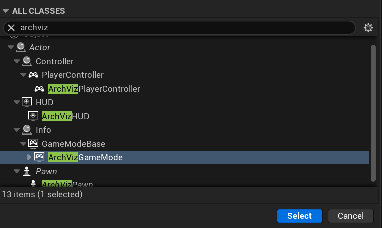
*Figure 1.6: Creating a Blueprint class inheriting from the C++ class ArchVizGameMode.*

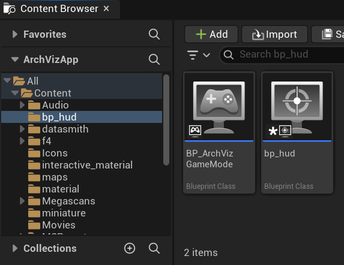
*Figure 1.7: The BP_ArchvizGameMode asset in your project Content Browser.*

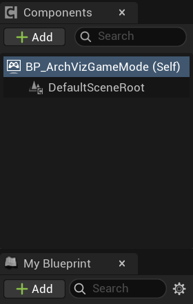
*Figure 1.8: The BP_ArchvizGameMode components hierarchy view.*

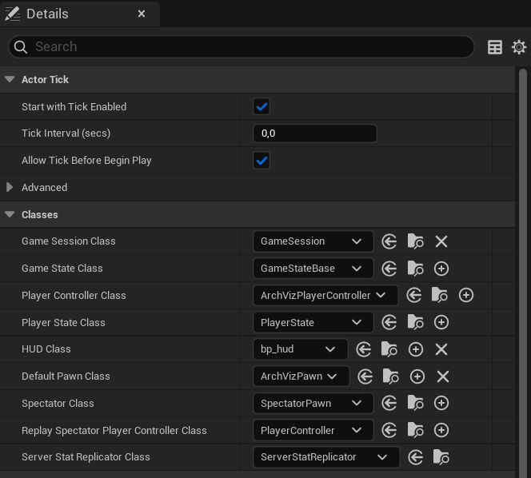
*Figure 1.9: Assigning the custom Pawn, HUD, and Player Controller overrides.*

---

### Point 4: HUD Customization & Custom Settings
The HUD acts as the user interface controller, managing all tool panels. You can customize the look, branding, language, and sounds of your application here:

1. Create a Blueprint Class inheriting from `ArchVizHUD` (e.g., `BP_ArchvizHUD`).
2. Open the HUD Blueprint in the editor.
3. Under the **Details** panel, configure the **Menu Category** settings (such as startup menu options, logo texture `MenuLogo`, quit button visibility, and language selector).
4. Configure the **UI Category** settings (such as center crosshair size `CrosshairDotSize`, default opacity, base color, and interactive highlight colors).
5. Configure the **Audio Category** settings (such as selecting specific sound cue/wav assets for interface interactions like `PanelOpenSound`, `UIClickSound`, and `LightSwitchSound`).
6. Compile and save the Blueprint.

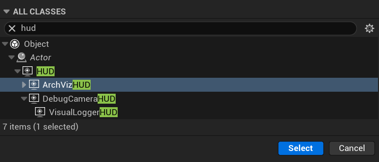
*Figure 1.10: Creating a Blueprint class inheriting from the C++ class ArchVizHUD.*

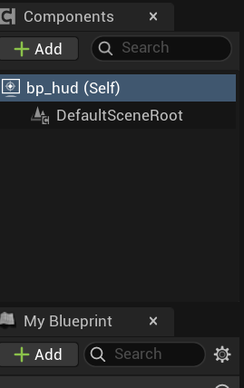
*Figure 1.11: The BP_ArchvizHUD asset in your Content Browser.*

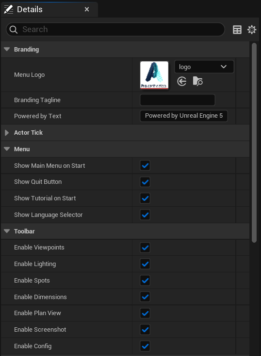
*Figure 1.12: Customizing main menu parameters, brand logo, and default tutorial settings.*

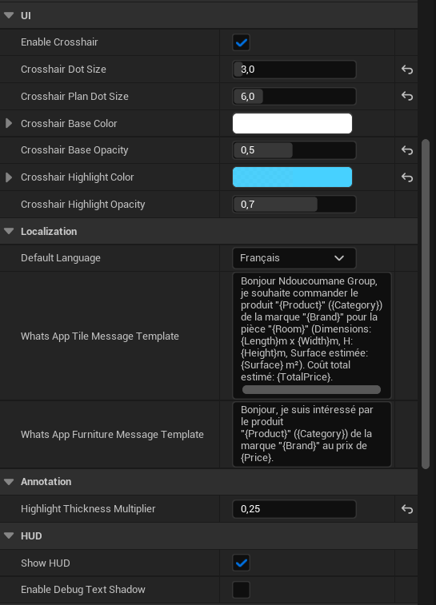
*Figure 1.13: Setting up crosshair sizing, opacity values, and active selection color codes.*

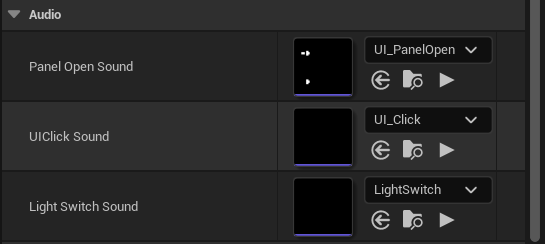
*Figure 1.14: Setting up sound effects for panel openings, light toggles, and clicks.*

---
---

## Part 2: Archviz Pawn Navigation

The custom navigation system supports two distinct view modes: **Orbit (3D Perspective) Mode** and **Floor Plan (2D Orthographic) Mode**. This allows users to inspect details from a standard viewpoint or switch to a structured layout map.

---

### Point 1: Orbit (3D Perspective) Mode Setup
Orbit mode allows the user to rotate, pan, and zoom around a target focal point, offering an interactive 3D inspection view of the scene.

1. Open your `BP_ArchvizPawn` Blueprint or select the pawn instance in the level.
2. In the **Details** panel, navigate to the **Camera** category to configure the custom orbit, panning, and zoom parameters:
   * **Orbit Speed** & **Pan Speed**: Define the responsiveness of rotation and horizontal movement.
   * **Zoom Speed** & **Zoom Interp Speed**: Set mouse wheel zoom speed and interpolation smoothness.
   * **Min Arm Length** & **Max Arm Length**: Establish constraints for minimum and maximum camera zoom distance (e.g., `50.0` to `3000.0`).
   * **Min Pitch** & **Max Pitch**: Control vertical viewing limits (e.g., `-85.0` to `85.0` degrees).
   * **Orbit Smooth** & **Pan Smooth**: Configure transition damping parameters for fluid movement.
   * **Min FOV** & **Max FOV**: Restrict the Field of View limits (e.g., `30.0` to `110.0` degrees).
3. Under the **Collision** category, define the pawn's navigation boundaries:
   * **Collision Radius**: Set the bounding sphere radius to prevent clipping through meshes (e.g., `25.0`).
   * **Min Height Above Floor**: Enforce a minimum safety height for the pawn (e.g., `40.0`).
4. Select the child **Camera** component to verify default Unreal Engine parameters under the **Camera** section:
   * **Projection Mode**: Set to `Perspective`.
   * **Field of View**: Set the default angle (e.g., `90.0` degrees).
5. Compile and save the Blueprint.

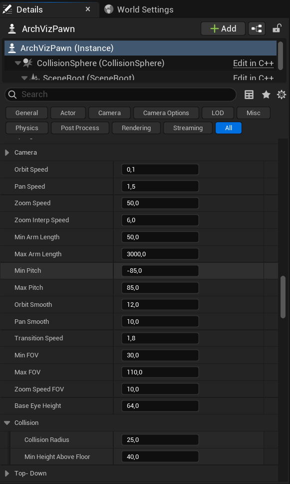
*Figure 2.1: Configuring the camera parameters on the Archviz Pawn for 3D navigation.*

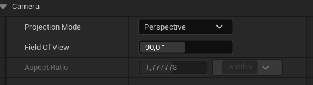
*Figure 2.2: Adjusting default perspective projection mode and Field of View settings.*

---

### Point 2: Floor Plan (2D Orthographic) Mode Setup
Floor Plan mode shifts the perspective to a top-down layout map view, letting users inspect floor layout spaces.

1. Open the `BP_ArchvizPawn` Blueprint and navigate to the **Details** panel.
2. Under the **Top-Down** category, customize the top-down camera behavior:
   * **Top Down Height**: Set the default camera elevation height above the floor (e.g., `2000.0`).
   * **Top Down Max Pan X / Y**: Restrict horizontal panning bounds in the world space (e.g., `1200.0`).
   * **Top Down Pan / Rotation / Zoom Smooth**: Tune interpolation speeds for panning, rotating, and zooming movements in plan view.
   * **Top Down Min Zoom / Max Zoom**: Define camera height limits during zoom interactions (e.g., `700.0` to `2000.0`).
   * **Top Down Pitch**: Enforce a default downward pitch angle for top-down perspective alignment (e.g., `-60.0`).
   * **Top Down Min / Max Pitch**: Set the allowed pitch range (e.g., `-89.9` to `-45.0` degrees).
   * **Top Down Center Actor**: Select or link a center pivot actor to define the main focus center point.
   * **Hide in Plan View Tag**: Specify an actor tag (e.g., `HideInPlan`) to automatically hide selected actors (like ceilings or lights) when switching to Floor Plan mode.
3. Add the actor tag `HideInPlan` to any level meshes that block the top-down camera view (such as ceilings, roof plates, or upper floor boards) to make them disappear automatically in plan view.
4. Compile and save the Blueprint.

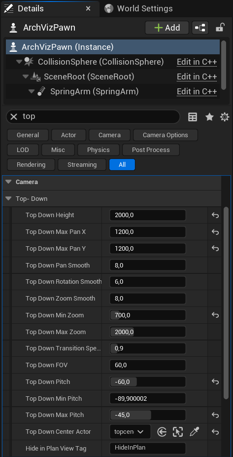
*Figure 2.3: Adjusting camera projection properties for Floor Plan navigation.*

---
---

## Part 3: Smooth Camera Viewpoints System

The Viewpoints system allows users to define target camera angles in the showroom level, enabling smooth transitions between rooms or highlight areas upon selecting buttons in the HUD.

---

### Point 1: Viewpoint Placement & Rotation
To setup camera checkpoints in your visualization project:

1. Drag and place the `CameraViewpoint` actor from the content list into your level viewport.
2. Position and rotate the actor to face the specific room or area you want to showcase (e.g., the living room, kitchen, or balcony).

---

### Point 2: Viewpoint Parameter Configurations
Customize the camera properties on the placed actor instance to configure the UI card and transition target:

1. Select the placed `CameraViewpoint` actor in the editor.
2. In the **Details** panel under the **Viewpoint** category, configure:
   * **Display Name**: Enter the text label shown on the HUD selection card (e.g., `Living Room`).
   * **Camera Distance**: Adjust the float value for the spring arm length from the pivot point (e.g., `42.0`).
   * **Camera Rotation**: Configure pitch, yaw, and roll default offset values for camera alignment.

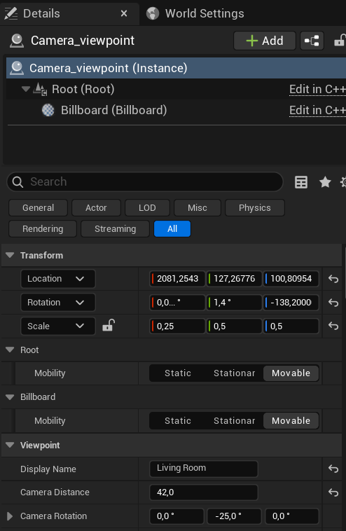
*Figure 3.1: Details panel configuration for a custom CameraViewpoint actor.*

---
---

## Part 4: Day-Night Sky & Lighting Controller

The `LightingController` manages level lighting actors, fog levels, and day-night presets, allowing users to toggle time-of-day scenarios interactively from the HUD.

---

### Point 1: Light Actor & Tag Connections
To sync environmental lighting with the controller, you must bind your level lighting actors:

1. Place the `LightingController` actor in your level.
2. In the **Details** panel under the **Lighting** category, link the following actors:
   * **Sun Light**: Assign your DirectionalLight (representing the sun).
   * **Ambient Sky Light**: Assign your SkyLight.
3. Configure the identification tags to locate interior and exterior lights in your scene:
   * **Interior Light Tag**: Enter `InteriorLight` (matching tags on your indoor lights).
   * **Daylight Light Tag**: Enter `DaylightPortal` (matching tags on your daylight portal lights).

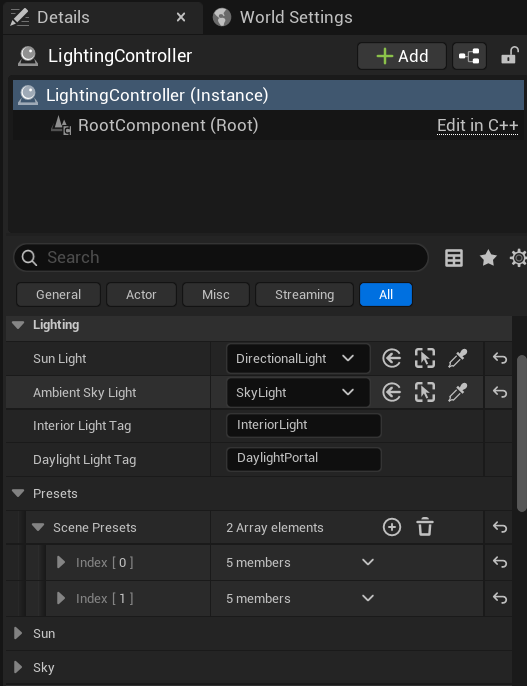
*Figure 4.1: Linking primary sky lights and entering identification tags.*

---

### Point 2: Time-of-Day Presets Configuration
Atmospheric presets are stored in the `Scene Presets` array, defining sun angles and light settings for each time-of-day option:

1. Expand the **Presets -> Scene Presets** array in the `LightingController` properties.
2. For each preset index (e.g. night, Day), configure the following values:
   * **Name**: The display name shown in the HUD (e.g., "night", "Day").
   * **Icon**: Unicode symbol representing the time of day.
   * **Time Of Day**: Float value between `0.0` and `1.0` controlling the sun's height/rotation (e.g., `0.75` for night, `0.0` for day).
   * **Interior Lights On**: Check this box if you want interior spot/point lights to turn on automatically during this preset (e.g., night-time).
   * **Button Color**: The button highlight color used in the HUD menu card.

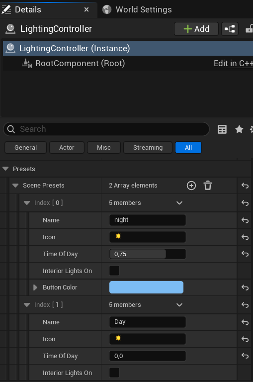
*Figure 4.2: Expanding and customizing the parameters for day and night presets.*

---
---

## Part 5: Lamp Groups Control System

The `LampGroupActor` coordinates groups and subgroups of light fixtures, synchronizing light actors and emissive materials to toggle light states and light intensity dynamically.

---

### Point 1: LampGroup Setup & Subgroup Array
To define a collection of lamps under a single UI group:

1. Place a `LampGroupActor` in your level.
2. Under the **Lamp Group** category in the Details panel:
   * **Group Name**: Set the category header name (e.g., `spot`).
   * **Sub Groups**: Add element indices representing subgroups (e.g., Living Room Spots, Kitchen Spots).

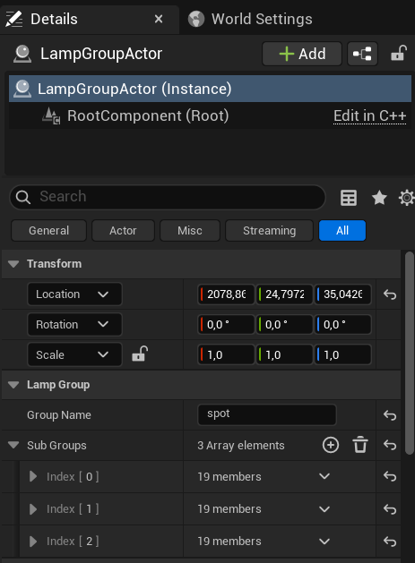
*Figure 5.1: Defining the primary Group Name and Sub Groups array size.*

---

### Point 2: Assigning Light Components
Link the individual light actors that belong to each subgroup:

1. Expand a subgroup index (e.g., Index [1]).
2. Set the **Name** parameter of the subgroup (e.g., `spot Salon`).
3. Add elements to the **Lights** array and link them to the specific light components or actors (e.g. RectLights, SpotLights) in the level.

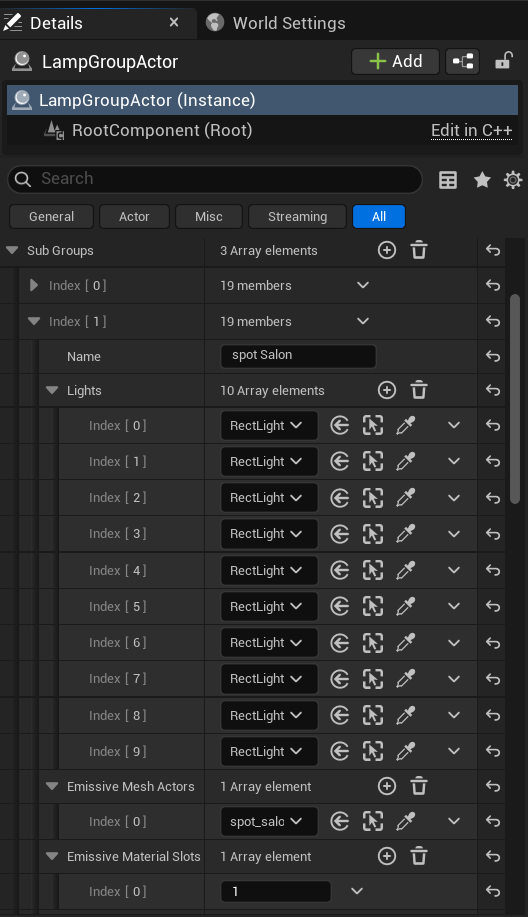
*Figure 5.2: Linking the Spot lights array and setting up emissive meshes.*

---

### Point 3: Emissive Material Synchronization
To make light fixture meshes glow automatically when turned on:

1. Under the subgroup settings:
   * **Emissive Mesh Actors**: Reference the target static mesh actor in the level.
   * **Emissive Material Slots**: Enter the material slot index on the static mesh that contains the emissive material (e.g., slot `1`).
   * **Emissive Parameter Name**: Set the scalar parameter name defined in the material shader (e.g., `EmissiveIntensity`).
   * **Emissive Color Parameter Name**: Set the vector parameter name for color (e.g., `EmissiveColor`).
   * **Max Emissive Value / Off Emissive Value**: Set the intensity multiplier for the emissive glow in the ON (e.g. `0.5`) and OFF (e.g. `0.02`) states.
   * **Max Light Intensity / Default Intensity**: Set the light components brightness range.
   * **Use Color Temperature / Color Temperature**: Enable color temperature presets (e.g. `7500K`).
   * **Start On / Is On**: Toggle checkboxes to define the default active state of the subgroup.

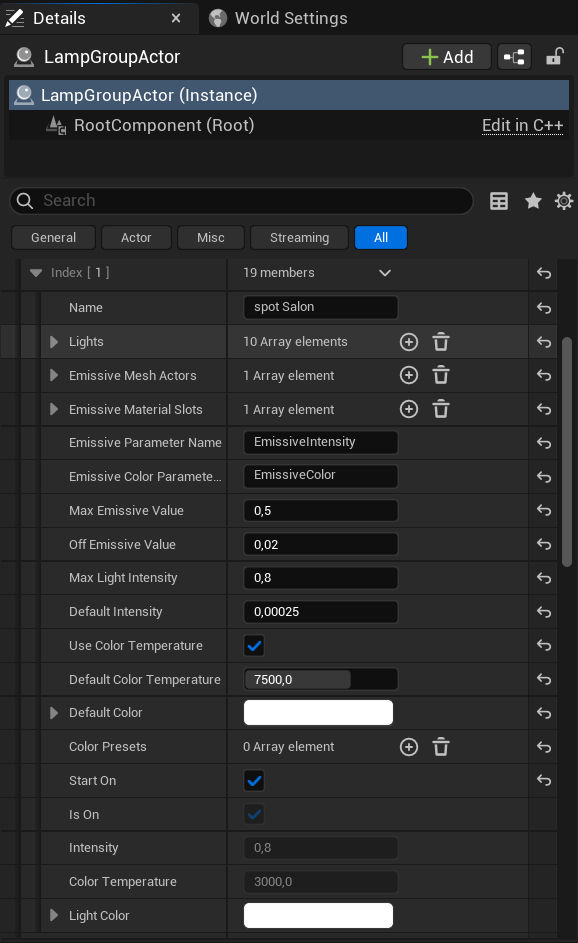
*Figure 5.3: Customizing emissive parameters, light intensities, and default states.*

---
---

## Part 6: Component-Based Material Swapper

The `MaterialSwapComponent` enables users to select alternative materials for specific static mesh slots (such as seat cushions, floors, or tables) dynamically from the HUD.

---

### Point 1: Material Groups Configuration
Attach and define the mesh slots targets on your interactive actors:

1. Attach the `MaterialSwapComponent` to your target actor (e.g., `Aria_Armchair_001`).
2. Navigate to the **Material Swap** category in the Details panel:
   * **Material Groups**: Add elements to define material swapping categories.
   * **Group Name**: Set the category label (e.g., `armchair`).
   * **Target Slot Indices**: Add the slot IDs of the static mesh material slots to modify (e.g., index `2` for seat cushion material).

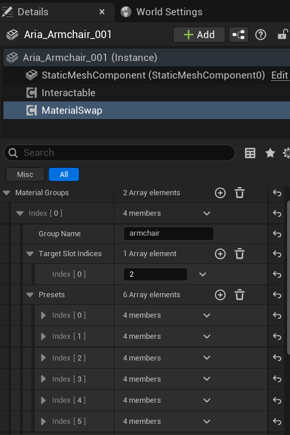
*Figure 6.1: Setting up Material Groups and target slot indexes.*

---

### Point 2: Presets & Preview Options
Store the available material choices for users to select in the HUD menu:

1. In the target group, expand the **Presets** array.
2. For each preset index, define:
   * **Preset Name**: Display text shown in the HUD selection card (e.g., `Material`).
   * **Material**: Assign the material asset interface.
   * **Preview Color**: Highlight color shown in the selection card.
   * **Preview Thumbnail**: The texture asset showing the material texture preview.

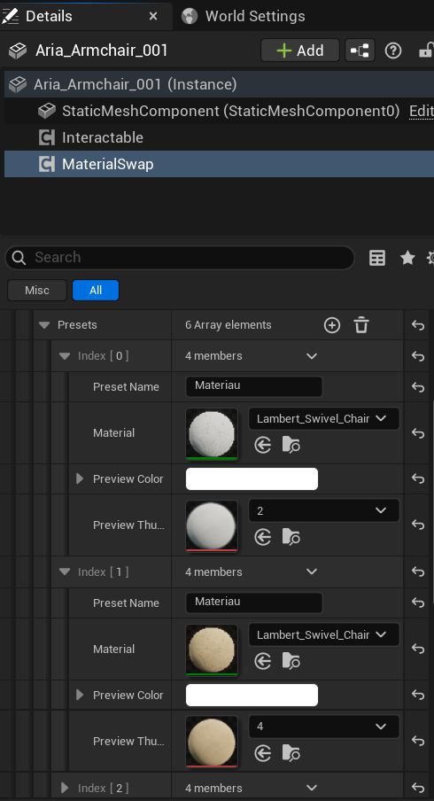
*Figure 6.2: Assigning material presets, colors, and thumbnails.*

---
---

## Part 7: Component-Based Furniture Swapper

The `FurnitureSwapComponent` enables users to swap meshes dynamically (e.g., switching wall panel designs or sofa models) from the HUD. It also coordinates material modifications corresponding to the active mesh variant automatically.

---

### Point 1: Mesh Options & Sizing Settings
Set up the alternative meshes and preview data:

1. Attach the `FurnitureSwapComponent` to your target actor (e.g., `wallpanel1`).
2. In the Details panel under the **Furniture Options** category:
   * **Furniture Options**: Add elements and link alternative static mesh assets (e.g., `wallpanel1`, `wallpanel2`, `wallpanel3`).
   * **Furniture Names**: Set the name label shown on the HUD cards (e.g., `wall pannel 1`, `wall pannel 2`).
   * **Furniture Thumbnails**: Assign preview thumbnail textures for selection buttons.
   * **Grow Duration**: Set the animation duration (e.g., `0.25` seconds) for the scaling effect when switching furniture.

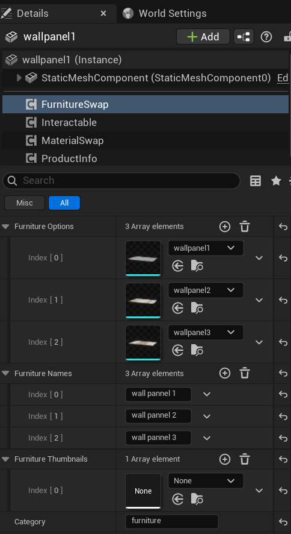
*Figure 7.1: Aligning mesh options, name tags, and grow animations.*

---

### Point 2: Per-Variant Material Group Sync
Configure material swaps to trigger automatically when specific meshes are activated:

1. In the component settings, navigate to the **Materials** category.
2. In the **Per Variant Materials** array:
   * Add index elements corresponding to each furniture option (e.g., Index [0] maps to the first wall panel mesh).
   * **Material Groups**: Add a swapping category under this variant (e.g., `Material`).
   * **Target Slot Indices**: Define slot indexes for variant materials (e.g., slot `0`).

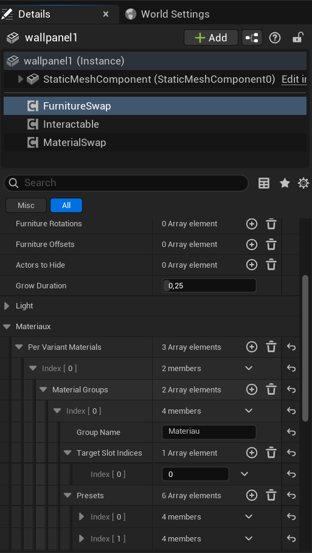
*Figure 7.2: Defining slot index mapping under variant material groups.*

---

### Point 3: Variant Material Presets Details
Set up the specific materials available for each mesh variant:

1. Under the variant's material group, expand the **Presets** array.
2. For each material option, assign:
   * **Preset Name**: Text label (e.g., `Material`).
   * **Material**: The target material interface asset (e.g., `floor2` or `floor1`).
   * **Preview Color**: Selection card background tint.
   * **Preview Thumbnail**: The thumbnail texture showing the material sample.

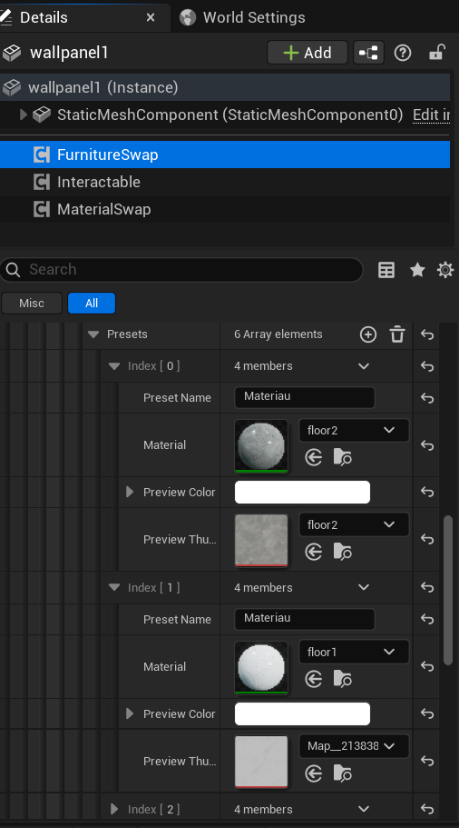
*Figure 7.3: Assigning material assets and previews for specific furniture variants.*

---
---

## Part 8: Furniture Variant Lighting & LED Customization

When static mesh variants have built-in lights (such as LED strips, backlight panels, or side lamps), the system allows you to link specific light components to furniture variants and customize their color presets from the HUD.

---

### Point 1: Subcomponent Light Tagging
Link child light components to their corresponding furniture mesh option:

1. Attach light components (e.g., point lights or spot lights like `led_left_var0`) as child components to your interactive actor (e.g., `wallpanel1`).
2. Select the target light component, and search for the **Tags** section in the Details panel.
3. In the **Component Tags** array:
   * Add a unique tag corresponding to the variant index (e.g., enter `Var0` at Index [0] to associate this light with the first furniture option).
   * The plugin automatically toggles visibility and settings based on these tags when switching options.

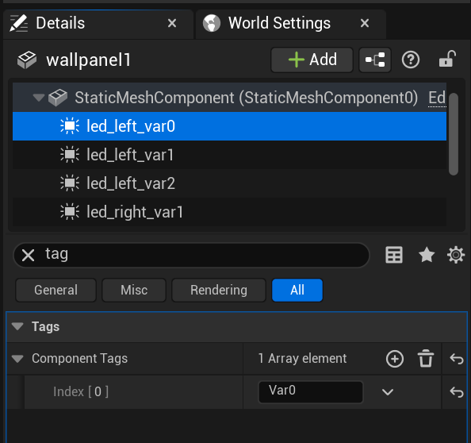
*Figure 8.1: Assigning Var0 tag to associate subcomponent lights with variant meshes.*

---

### Point 2: Furniture Light Properties
Enable lighting controls on your furniture swapping actor:

1. Select your `FurnitureSwapComponent`.
2. Locate the **Light** category in the Details panel:
   * **Has Lights**: Check this box to enable integrated light variants.
   * **Is Light On**: Set the default active state of the variant lights (ON/OFF).
   * **Current LEDColor**: The active color state of the lights.
   * **Current LEDIntensity / Max LEDIntensity**: Configure brightness parameters and maximum threshold limit (e.g., `0.3`).

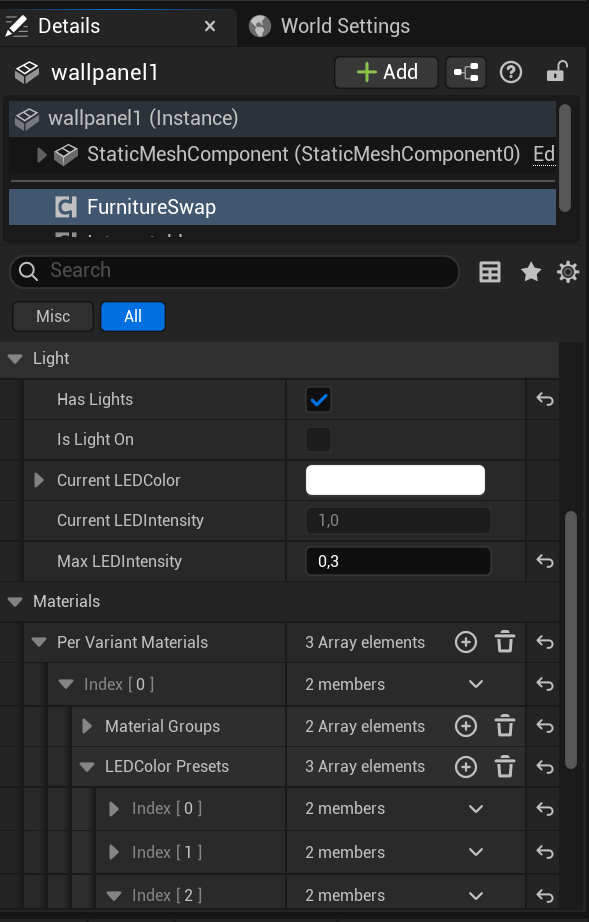
*Figure 8.2: Configuring Has Lights checkbox and light intensity thresholds.*

---

### Point 3: LED Color Presets Setup
Configure the preset colors that users can cycle through using sliders/buttons:

1. In the `FurnitureSwapComponent`, expand the **Per Variant Materials** settings.
2. Open the **LEDColor Presets** array:
   * Add color choices shown in the UI.
   * For each preset, set **Name** (e.g. `yellow`, `white`, `blue`) and select the corresponding **Color** parameters.

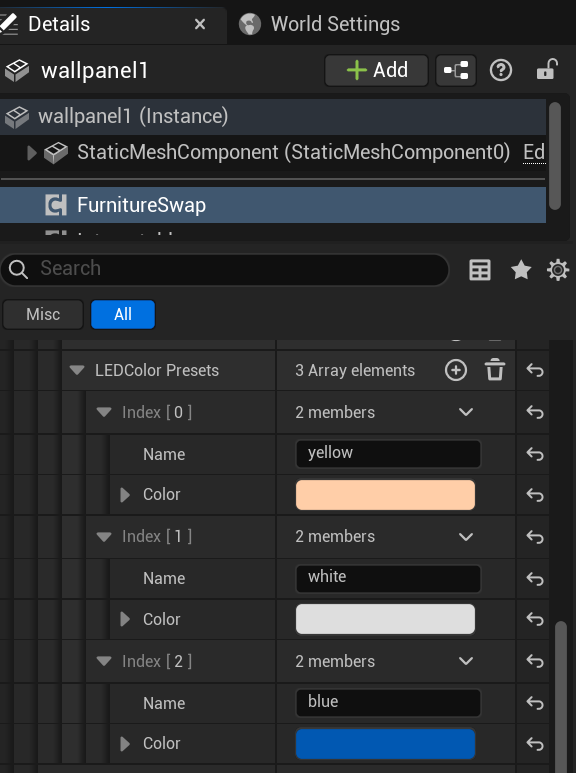
*Figure 8.3: Customizing the names and values for LED color presets.*

---
---

## Part 9: Interactive TV Component

The `TV` component (used alongside the `Interactable` component) enables interactive television blueprint systems, letting users turn it on/off, select channels, play videos, and control spatial audio.

---

### Point 1: TV Screen Material & Texture Setup
Configure the screen mesh and texture parameters:

1. Attach the `TV` and `Interactable` components to your TV actor.
2. Create a Material containing a 2D Texture parameter linked to the Emissive channel (e.g., `M_TV_Screen`).
3. Under the **TV** settings in the Details panel:
   * **Static Mesh Component**: Assign the static mesh component that represents the screen geometry.
   * **Screen Material Slot**: Enter the material slot index on the static mesh representing the screen (e.g., slot `1`).
   * **Param Name**: Set the texture parameter name defined in the screen shader (e.g., `ScreenTexture`).

---

### Point 2: Sound & Attenuation Settings
Configure the spatialized audio that matches the video states:

1. Add an child **Audio** component to your TV actor (e.g., `TV_Sound`).
2. Under the **TV** component settings, assign the child component:
   * **Audio Component**: Link the child audio component.
   * **Sound Attenuation**: Link a Sound Attenuation asset (e.g., `ATT_TV`) to physicalize distance-based audio volume falloff.

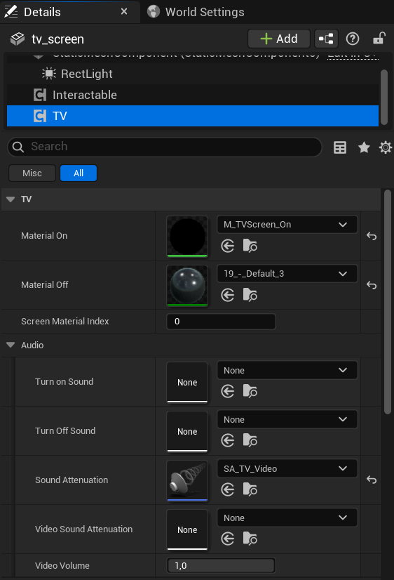
*Figure 9.1: Configuring the screen mesh, material parameters, and child audio component.*

---

### Point 3: MediaPlayer & Video Source Setup
Configure media players and default texture states:

1. Locate the **TV** category settings:
   * **Media Player**: Link your custom Unreal Engine `MediaPlayer` asset.
   * **Video Source**: Assign a default Media Source asset (local MP4 file or network stream).
   * **Default Screen Color**: Configure the background color of the screen when turned OFF.
   * **Intensity Screen**: Adjust the emissive texture glow brightness when turned ON (e.g., `1.5`).

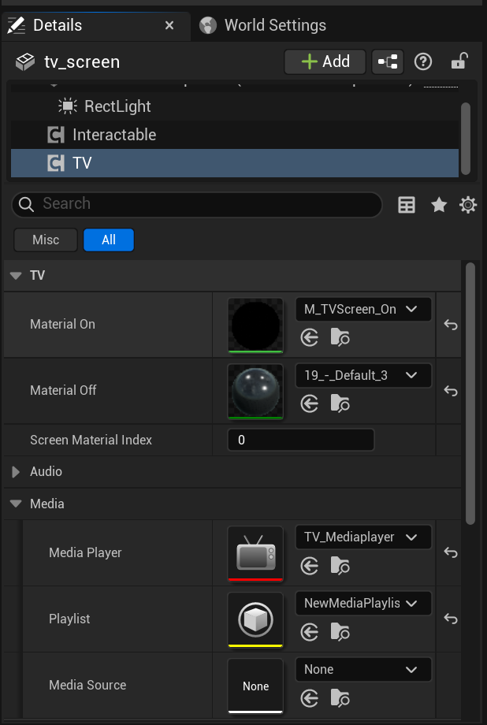
*Figure 9.2: Binding MediaPlayer objects, setting default video streams, and tuning screen brightness.*

---
---

## Part 10: Interactive Door Component

The `Door` component (used alongside the `Interactable` component) enables doors, drawers, or cabinet panels to rotate or slide open interactively when clicked, supporting angle constraints and spatialized sound effects.

---

### Point 1: Door Mechanical & Animation Setup
Configure the movement type, target mesh, and limits:

1. Attach the `Door` and `Interactable` components to your door actor.
2. Under the **Door** category in the Details panel, configure the mechanical parameters:
   * **Door Type**: Select `Rotation` (for swing doors) or `Sliding` (for drawers, cabinets, and sliding doors).
   * **Target Component**: Select the child static mesh component to animate (e.g., the door panel mesh).
   * **Limits**:
     * **Max Rotation Angle**: Define the maximum swing angle in degrees (e.g., `90.0` or `-90.0`).
     * **Max Slide Distance**: Define the maximum sliding distance in centimeters (e.g., `120.0`).
   * **Door Speed**: Adjust the open/close animation speed multiplier (e.g., `3.0`).

---

### Point 2: Linked Doors & Audio Setup
Sync double doors and configure spatialized sound assets:

1. Link double doors to open together:
   * **Linked Doors**: Add actors to the array to trigger synchronous openings (e.g., when the left door is clicked, the right door swings open automatically).
2. Configure audio effects under the **Audio** category:
   * **Open Sound** & **Close Sound**: Assign sound cue assets for opening and closing sounds.
   * **Audio Attenuation**: Link a Sound Attenuation asset to enforce distance-based audio falloff.

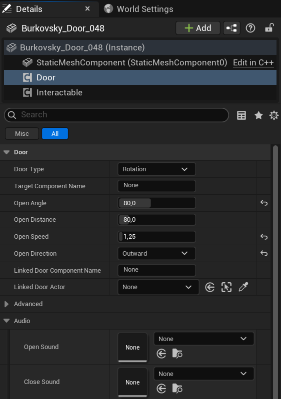
*Figure 10.1: Configuring movement types, animation limits, dual-door linkages, and spatialized audio cues.*

---
---

## Part 11: Interactive Faucet Component

The `Faucet` component (used alongside the `Interactable` component) enables interactive tap assemblies, letting users click to turn on/off water flow. It coordinates faucet handle rotation, manages spatialized running water sound cues, and drives water simulation assets such as Alembic Geometry Caches or Niagara systems.

---

### Point 1: Faucet Handle & Movement Settings
Set up the mechanical handle rotation when the faucet is turned on:

1. Select the Faucet Actor in your level (e.g., `faucet_cgsan_com001`).
2. Attach the `Faucet` and `Interactable` components.
3. Select the **Faucet** component and navigate to the **Faucet** category in the Details panel:
   * **Handle Component Name**: Enter the exact name of the child static mesh component representing the handle (leave as `None` to target the default handle sub-component).
   * **Open Rotation Offset**: Set the rotation values (Roll, Pitch, Yaw) applied to the handle when fully opened (e.g., `-90.0`, `0.0`, `0.0` degrees).
   * **Animation Speed**: Adjust the speed multiplier for the rotation animation (e.g., `2.5`).

---

### Point 2: Water Simulation & Alembic Cache Setup
Configure the visual water flow using Alembic Geometry Cache files or Niagara particle systems:

1. Attach a **Geometry Cache** component as a child component to the actor.
2. Select the **Geometry Cache** component and assign the source asset (e.g., `water_simulation`) and the water material (e.g., `M_Water_Ocean1`).

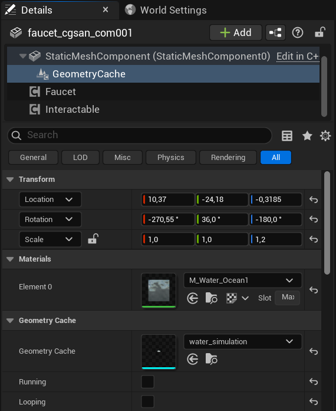
*Figure 11.1: Geometry Cache component structure and water material slot configuration.*

3. Under the **Faucet** component properties, configure the following:
   * **Water Effect**: Link a particle system or Niagara effect if not using Geometry Cache (otherwise set to `None`).
   * **Water Attach Point Name**: The name of the socket or attach point on the mesh where the water simulation should align (e.g., `None`).
   * **Alembic Category**:
     * **Loop Start Time**: Set the start timestamp in seconds for the looped section of the Alembic simulation cache (e.g., `1.0`).
     * **Loop End Time**: Set the end timestamp in seconds for the looped section (e.g., `3.9`).
     * **Auto Align Water**: Check to let the system automatically position the water stream.
     * **Water ZScale**: Define the vertical scaling scale factor for the water flow (e.g., `1.0`).

---

### Point 3: Audio & Distance Attenuation Settings
Configure the spatialized audio that matches the running water states:

1. Locate the **Audio** category under the **Faucet** component:
   * **Water Sound**: Assign the sound wave or cue asset for flowing water (e.g., `Bathroom_Tap_Water_Source`).
   * **Loop Sound**: Check this box to enable continuous looping of the flowing sound while the tap is active.
   * **Audio Attenuation**: Link a Sound Attenuation asset (e.g., `ATT_water`) to enable physical distance-based audio volume falloff.

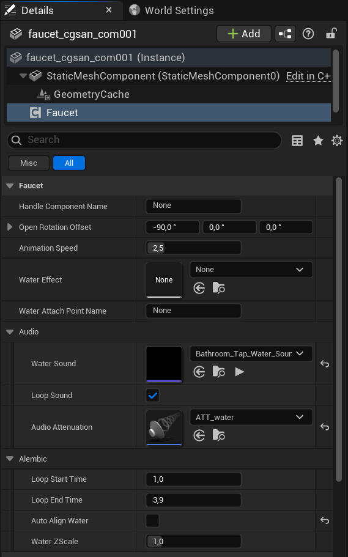
*Figure 11.2: Faucet movement properties, audio settings, and Alembic cache looping parameters.*

---
---

## Part 12: Product Information Catalog System

The `ProductInfo` component allows actors to link with a central Unreal Engine Data Table database (`ProductCatalog`), displaying specifications (name, brand, price, description, URL, and preview thumbnails) of furniture or fittings when selected in the showroom viewport. It also coordinates with furniture swapping so that switching a mesh variant automatically pulls the corresponding product info row.

---

### Point 1: Product Data Table Schema & Entry Creation
Create and fill the central catalog database with product details:

1. Open your `ProductCatalog` Data Table asset in the Unreal Editor.
2. Click **Add** to create a new row, and assign a unique **Row Name** identifier (e.g., `Canape_Loft_4P`).
3. Fill out the properties in the Row Editor:
   * **Product Name**: The display title shown to users (e.g., `Canapé Loft 4 Places`).
   * **Brand Name**: Manufacturer/Brand label (e.g., `Maison Design DZ`).
   * **Price / Currency**: Numeric cost and currency symbol (e.g., `3500.0` and `$`).
   * **Description**: A detailed description of dimensions, materials, and styling (e.g., scandinavian design, fabric details).
   * **Product URL**: A direct external hyperlink to the product's official purchase page.
   * **Category**: Group tag (e.g., `Sofa`).
   * **Thumbnail**: Select a 2D preview texture displayed in the catalog HUD panel.

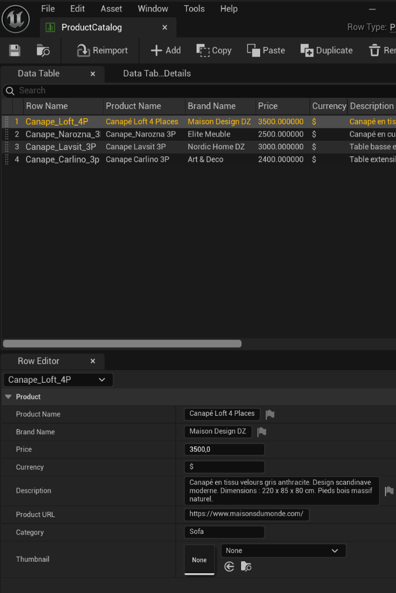
*Figure 12.1: Editing catalog database entries, pricing, URLs, and descriptions within the Data Table.*

---

### Point 2: Assigning Product Info to Actors
Link interactive scene assets to specific database rows:

1. Select your target actor in the viewport (e.g., `canape`).
2. In the components list, add the `ProductInfo` component (ensure the actor also contains the `Interactable` component).
3. Select the **ProductInfo** component and go to the Details panel:
   * **Product Data Table**: Bind the `ProductCatalog` asset containing the specifications.
   * **Product Row Name**: Choose or type the default active Row Name (e.g., `Canape_Loft_4P`).

---

### Point 3: Per-Variant Product Mapping
Sync specifications when a user switches furniture meshes:

1. If the actor uses a `FurnitureSwapComponent`, expand the **Catalog** category under the `ProductInfo` settings.
2. In the **Per Variant Row Names** array, add rows corresponding directly to the mesh options in the swap component.
3. Assign each element index to its corresponding row name (e.g., Index [0] = `Canape_Loft_4P`, Index [1] = `Canape_Narozna_3P`, Index [2] = `Canape_Lavsit_3P`, etc.).
4. When a user cycles through options in the viewport, the HUD catalog panel dynamically updates to show the selected variant's active specs, brand, pricing, and purchase link.

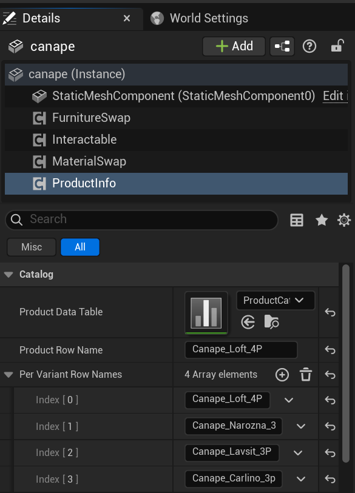
*Figure 12.2: Details panel configuration linking the ProductInfo component to the catalog table and variant rows.*

---
---

## Part 13: Room Annotation Component

The `room_annotation` component enables spatial labeling and auto-dimensioning for zones and rooms. It displays interactive UI badges in the 3D viewport containing room names, height, floor surface area, and volume, alongside physical dimension guide lines.

---

### Point 1: Room Labeling & Badge Placement
Configure the basic labeling and 3D positioning for your room annotations:

1. Select your annotation actor in the level (e.g., `salon_2`).
2. Attach the `room_annotation` component.
3. Select the **room_annotation** component and locate the **Annotation** and **Display** categories in the Details panel:
   * **Room Name**: Enter the text label shown in the 3D badge (e.g., `salon`).
   * **Badge Color**: Click the color picker to set the theme color of the 3D floating tag.
   * **Annotation Offset**: Define the X, Y, and Z coordinate offset values to position the text badge above the actor's pivot point (e.g., `0.0`, `0.0`, `120.0`).

---

### Point 2: Auto-Detection & Size Calculations
Configure raycasting options to automatically calculate room measurements:

1. In the Details panel under the **Auto-Detection** category:
   * **Auto Detect**: Check this box to enable automatic raycast measuring.
   * **Max Raycast Distance**: Define the maximum reach threshold for distance-measuring raycasts (e.g., `2000.0` units).
   * **Raycast Height Offset**: Offset the height from the actor pivot where raycasts are fired (e.g., `100.0` units).
2. Under the **Display** category, check the specifications to calculate and display:
   * **Show Height**: Toggle to compute and display the floor-to-ceiling height in meters.
   * **Show Surface**: Toggle to calculate the surface area in square meters ($m^2$).
   * **Show Volume**: Toggle to calculate the volume in cubic meters ($m^3$).

---

### Point 3: Dimensions Layout & Guide Lines
Customize the physical layout and visual measurement guidelines:

1. Under the **Display** and **Layout** settings, configure dimension lines:
   * **Show Dimension Lines**: Check to render interactive measurement guidelines outlining room edges.
   * **Dimension Line Offset**: Adjust the spacing/offset of the dimension lines from the wall surfaces (e.g., `30.0`).
   * **Highlight Thickness Multiplier**: Set the line thickness for measurement guidelines (e.g., `2.0`).
2. Manage bounding boxes and visibility:
   * **Hide Mesh in Game**: Check this box to hide the reference bounding static mesh or collision volume during play, showing only the text badge and dimension lines.
   * **Use Mesh Bounds for Dimensions**: When checked, the component uses the static mesh's direct bounding box size to compute dimensions instead of utilizing active raycasting.

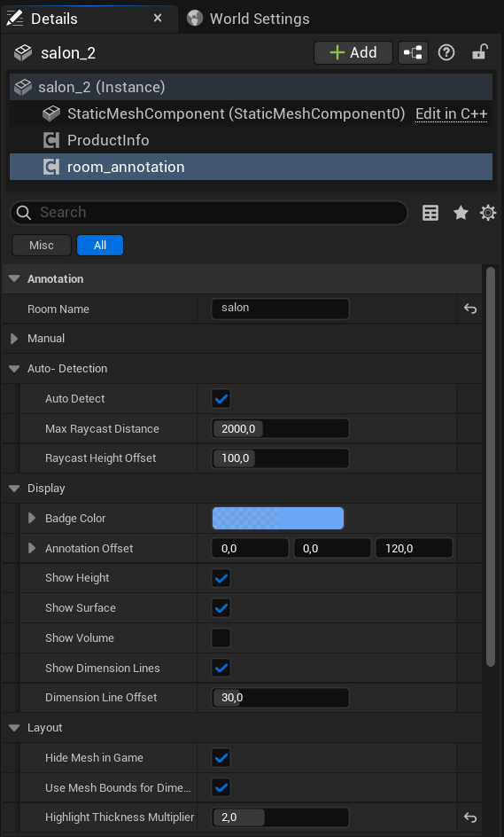
*Figure 13.1: Details panel configuration for room labeling, auto-detection, display parameters, and mesh visibility.*
